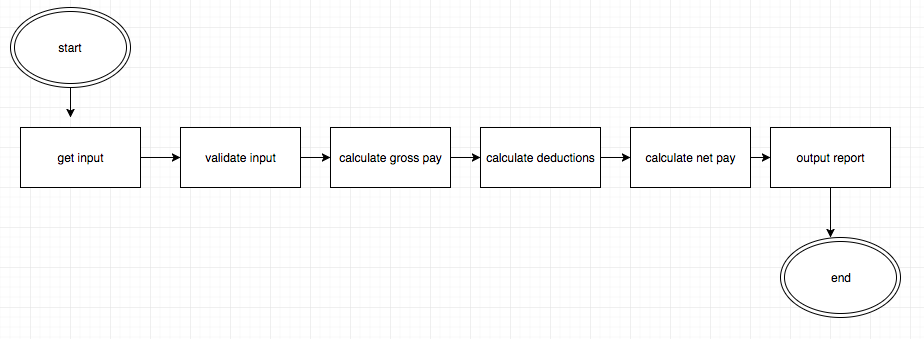

# 02_05_overtime

- Accept [02_05_overtime](https://classroom.github.com/a/3zRTHMxN)
- Get [main.cpp](main.cpp)

## Description

- pay rate for the first 40 hours work in a week is $100.00 per hour 
- overtime is time and a half
- deductions:
    - social security tax: 6%
    - federal income tax: 14%
    - state income tax: 5%
    - union dues: $10
    - health insurance for more than three dependents: $35
- read number of hours worked and number of dependents
- output gross pay, each withholding amount, net take-home pay

## Notes

- Place all numbers (rates, tax percentages, union dues, insurance expense, etc.) in constants.
- Avoid if / else inside if / else inside if / else.
- Design in blocks.
- Pay close attention to spacing. all your numbers must line up.
    - Use setw() from iomanip. Do not waste time with adding spaces.
- Set your pay rate to $100 per hour. This will make it easier to check the accuracy of your calculations.
- Do NOT do calculations in the cout statement. Keep processing separate from the output:
    - You will need variables for each of the tax amounts.
    - You will need variables for total deductions.
    - You will need variables or gross and net.
    - There will be absolutely no calculations in your output statements.
- Test for all possibilities:
    - hours < 40, == 40, > 40
    - num of dependents: < 3, ==3, > 3

## Design

Here is a tentative design you can start with. Your final product should resemble this design:

