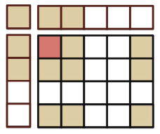
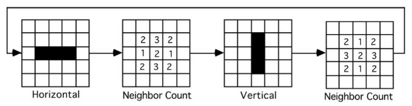
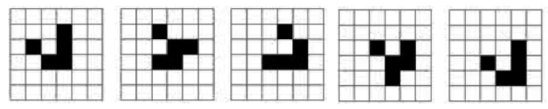

# 07_06_game_of_life

- Accept [07_06_game_of_life](https://classroom.github.com/a/Ju-svyLB)
- Get [main.cpp](main.cpp)
- Get [game_of_life.h](game_of_life.h)
- Get [save.txt](save.txt)

## Description

The goal of this project is to create a simulation of John Conway’s Game of Life using two-dimensional arrays. Each element of the array represents a cell that is either alive or dead. Once an initial state is set up, the program will generate new generations based on the following

### Rules of the Game
- A live cell with two or three live neighbors will remain alive.
- A live cell with fewer than two live neighbors will die.
- A live cell with more than three live neighbors will die.
- A dead cell with exactly three live neighbors will become a live cell.

The “neighbors” of a cell are the adjacent and diagonal cells. (not include itself, so 8 neighbors for one cell)

## Purpose

This project will be the culmination of the content discussed in this course.

- Design: You will be building a functional hierarchy that will make managing this process easier. Low-level functions will act as tools on top of which higher-level functions will be built upon. This is the most important part of this project as we spent a great deal of time talking about this issue not to mention all the projects we built with these ideas in mind.
- Flow of Control: The process of creating consecutive generations will be near impossible to do without using various nested loops.
- Functions: There will be many functions used to break down the project into specific tasks that must be performed each time a new generation is generated.
- Input/Output streams: Files will be used to import and export a pattern or generation’s current state.
- Arrays: This is the heart of the project; a two-dimensional array is used to represent a generation of cells, with each element of the array representing an individual cell.

## Design Specifications

There must be a temporary holding place for each new generation:

- Main Two Dimensional Array: There will be a main 2D array that will represent the state of the current generation.
- Temporary Array: When creating the next generation, changes made to the main array will interfere with the current generation’s actual state. The temporary array will be used to determine which cells in the next generation are alive and which are dead. Once every cell has been processed, transfer the temporary cell’s state to the main array so that the process may be repeated.

### CIRCULAR

The board is virtually connected by the edges and the corners:

- The first row and the last row are neighbors (adjacent) and the first column and the last column are neighbors (adjacent) so, a cell on the first row will have neighbors on the last row.

Consider the example of the top-left corner cell:
- This cell must be able to use the last 2 cells on the bottom, the last 2 cells on the right, and the lower-right corner cell as its neighbors. By using the border to reflect those cells, the task of checking the neighbors of the corner cell is greatly simplified.

### SAVE/LOAD

Patterns can be exported and imported to and from text files.
- The text files will simply be characters used to represent consecutive cells as either alive or dead, separated by line breaks to differentiate between rows.

### MENU
[S]tep  [G]o  [R]andom  [C]lear  [T]oggle  sa[V]e  [L]oad  [?]Menu  e[x]it

- S = One step: display the next generation
- G = Go: Run for ten generations.
- R = Random: add an additional n random live cells. n depends on the size of the array.
- C = Clear: the grid
- T = Toggle: ask the user for a row and a column, then set toggle the cell at those coordinates.
- V = Save: the grid in a text file
- L = Load: the grid from the disk file 
- ? = Display Help: show the Menu.
- X = Exit: exit game

#### These are necessary functions

##### Displaying Generations
- Step: Display the next generation.
- Go: Run 10 steps.

##### Altering the Cells
- Random: Add an additional n random live cells.
- Clean: Clear the world

##### Input/Output files
- SaveGrid: Save the entire two-dimensional array to a file.
- LoadGrid: Import a saved screen into the array. Useful for testing the SaveScreen function.

##### Click on the Cell
- Toggle: ask the user for a row and a column, then:
If the cell is alive, make it died
If the cell is dead, bring it to live

##### System

- Menu: display command menu
- Exit: exit game

## Common Patterns

### Blinker

Useful during the initial stages of testing

### Glider

Useful for testing the edges of the array. If the edge cells are connected properly, the glider should reappear in the top-left corner when it reaches the bottom-right.

## Reference

1. Follow the instructions in the textbook.
2. https://en.wikipedia.org/wiki/Conway%27s_Game_of_Life
3. https://playgameoflife.com/
