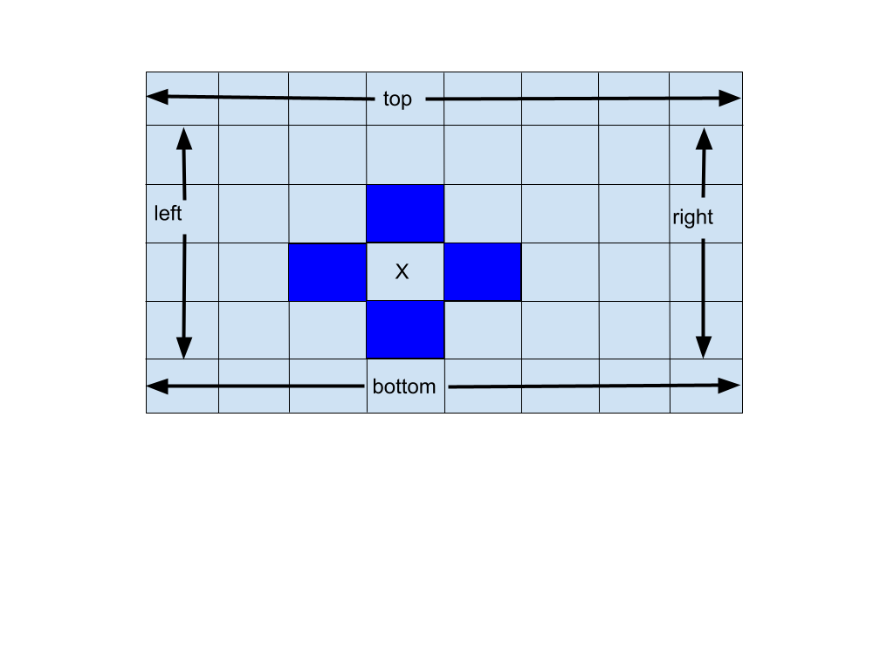

# 07_07_temperature_distribution

- Accept [07_07_temperature_distribution](https://classroom.github.com/a/ufnu_0TP)

## Description

The temperature distribution in a thin metal plate with constant (or isothermal) temperatures on each side can be modeled using a two-dimensional grid, as shown in the figure below. Typically, the number of points in the grid is specified, as are the constant temperatures on four sides. The temperatures of the interior points are usually initialized to zero, but they change according to the temperatures around them. Assume that the temperature of an interior point can be computed as the average of the four adjacent temperatures; the points shaded in the grid below represent the adjacent temperatures for the point labeled x in the grid. Each time that the temperature of an interior point changes, the temperatures of the points adjacent to it change. These changes continue until a thermal equilibrium is achieved and all temperatures become constant.




## Basic algorithm

1. Get data from the user and output result.
1. Read from the input the initial temps for the top, right, bottom, and left sides of the plate.
1. Read from the input the tolerance for equilibrium.
1. Initialize the edges of the 2D grid with the initial temps you got from the input, and initialize the inner cells of the grid to 0.0.
1. Continue updating temperature values within inner cells until equilibrium is reached.
1. Output to the result the values of the inner cells of the grid after equilibrium is obtained.
    - `cout << setw(10) << g[i][j];`


### Step 5 details

- - When updating the grid's temperatures always start at the top, left inner cell and update that row before updating the row below it. So, the first cell to be updated will be grid[1][1], then grid[1][2], and so on.
Never change an edge cell's temperature.
- A cell's new temperature will always be the average of the 4 cells adjacent to it, the cells immediately above, below, left, and right of the cell.
- You should update all inner cells of the entire grid, while always keeping track of the largest difference between the old value and the new calculated value for a cell. Once you have completely updated the grid, if your max difference is within the tolerance level, equilibrium has been reached. You are done. Go ahead and output the temperatures in each cell of your grid. If not, you need to update the entire grid again.
- You are required to use 2D arrays, NOT vectors, for this assignment.
- The grid dimensions will always be the same as the grid example above (6 X 8).

## Output sample

```
Enter top, right, bottom, left, tolerance:
29 45 0 15 0.5
   20.6404   22.6151    23.944   25.7453   28.7711   34.1826
   16.4471   17.5668   19.1289   21.8528   26.5254   34.0902
   13.1644   12.8385   13.9106   16.6151   21.7503   30.7639
   8.81194    7.2602   7.58734   9.35255   13.3295   22.2734
again? n
```
